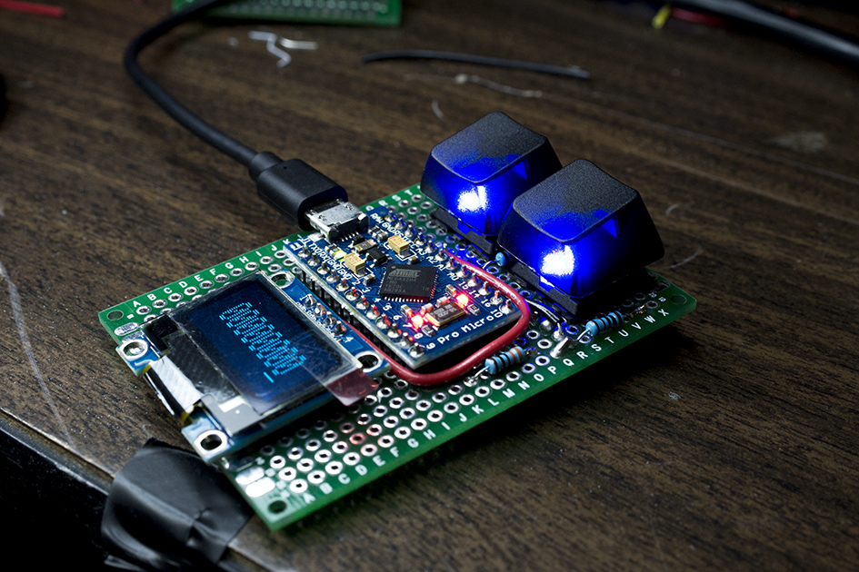
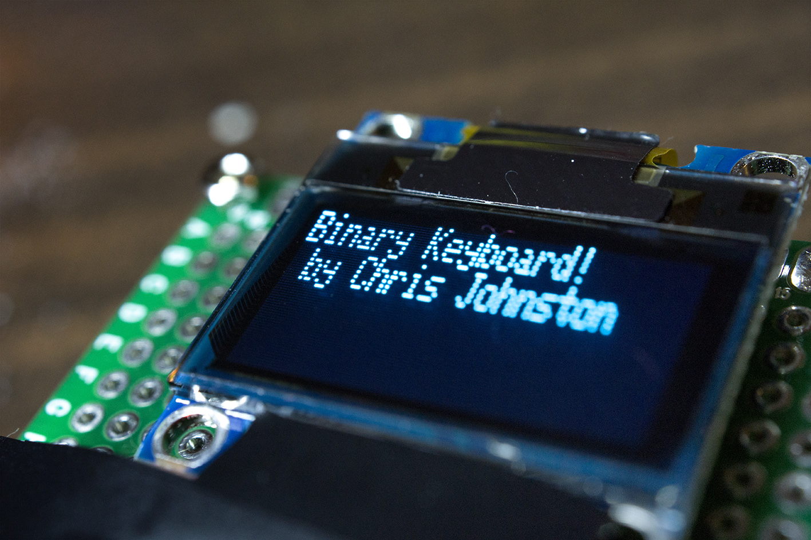
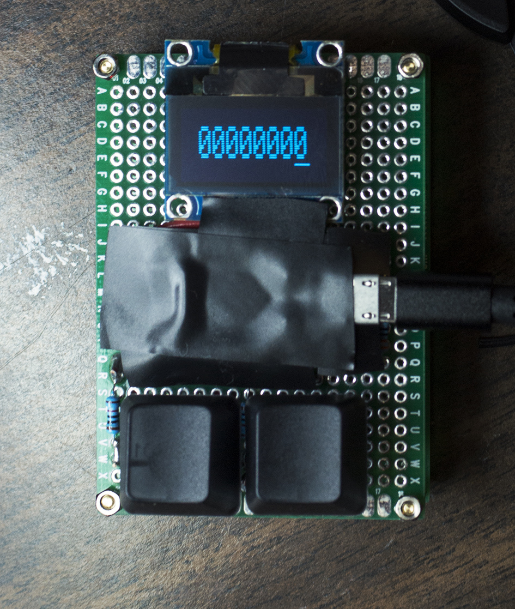
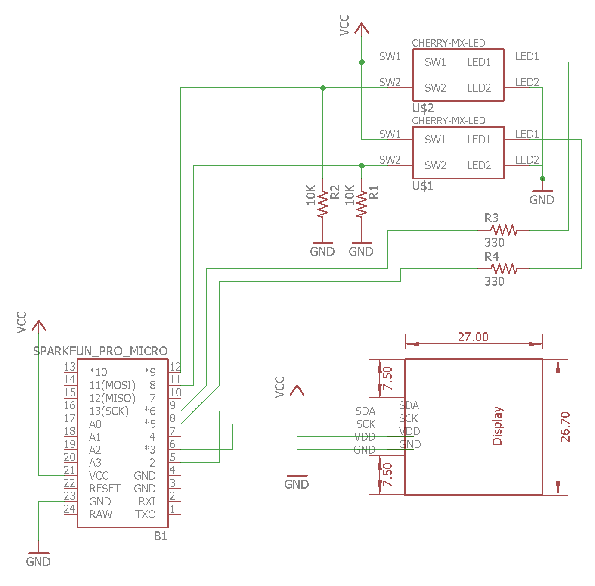

# BinaryKeyboard
A two-button backlit mechanical keyboard that types ASCII values, one bit at a time.

## Photos

## GIFS

Typing the backspace character, followed by switching between modes.

Demonstrating left to right input.

New animations added to '1/0' mode. (Still working on a name for that).

Demonstrating compatibility with USB OTG.

Boot up sequence.

Demonstrating right to left input.

Demonstrating switching between typing modes.

Close-up of the blue led backlit keys.

# Technical Info

## Schematic

## Components
- Arduino Pro Micro (knockoff) [AliExpress - $3](https://www.aliexpress.com/store/product/Free-Shipping-New-Pro-Micro-for-arduino-ATmega32U4-5V-16MHz-Module-with-2-row-pin-header/318950_1348800135.html)
- Cherry MX Clear PCB Mount Mechanical Switches [MechanicalKeyboards.com - $10, w/ bulk pricing options](https://mechanicalkeyboards.com/shop/index.php?l=product_detail&p=594)
- SSD1306 OLED Display [AliExpress - $2.72](https://www.aliexpress.com/item/Wholesale-0-96-inch-4pin-White-OLED-Module-SSD1306-Drive-IC-128-64-I2C-IIC-Communication/32658908775.html?ws_ab_test=searchweb0_0,searchweb201602_4_10152_10065_10151_10068_10130_10136_10137_10060_10138_10155_10062_10156_10154_10056_10055_10054_10059_10099_10103_10102_10096_10148_10147_10052_10053_10142_10107_10050_10051_10084_10083_10080_10082_10081_10178_10110_10111_10112_10113_10114_10181_10037_10078_10079_10077_10073_10070_10123_10124,searchweb201603_1,afswitch_1,ppcSwitch_3&btsid=055812c7-c728-4744-bd70-e33da76f8242&algo_expid=f8fb9ab1-cd07-4575-a544-a11a33f28421-2&algo_pvid=f8fb9ab1-cd07-4575-a544-a11a33f28421)
- Blue 2 * 3 * 4 mm LEDs [AliExpress - $2.29 / 100ct](https://www.aliexpress.com/item/EC-Buying-100pcs-2X3X4-LED-Blue-Transparent-DC-Rectangle-LED-Light-Emitting-Diode-2-3-4/32806132582.html?ws_ab_test=searchweb0_0,searchweb201602_4_10152_10065_10151_10068_10130_10136_10137_10060_10138_10155_10062_10156_10154_10056_10055_10054_10059_10099_10103_10102_10096_10148_10147_10052_10053_10142_10107_10050_10051_10084_10083_10080_10082_10081_10178_10110_10111_10112_10113_10114_10181_10037_10078_10079_10077_10073_10070_10123_10124,searchweb201603_1,afswitch_1,ppcSwitch_3&btsid=54ec29ec-c549-4d5f-a95b-290ab57c28c5&algo_expid=802203e6-7262-45b3-bbf0-e52533f80bf5-0&algo_pvid=802203e6-7262-45b3-bbf0-e52533f80bf5)

## Arduino Library Requirements
These libraries are used to drive the SSD1306 OLED display.
- [Adafruit_GFX](https://github.com/adafruit/Adafruit-GFX-Library)
- [Adafruit_SSD1306](https://github.com/adafruit/Adafruit_SSD1306)

## Eagle Schematic Details
Because I could not locate a part to represent the SSD1306 OLED Display, I created my own. This can be found in the 
`CSJ Library` file for Eagle. A word of warning, this was my first time using Eagle. The part works, but could be improved.

Uses [c0z3n/cherrymx-eagle](https://github.com/c0z3n/cherrymx-eagle/) library as well.

## Usage
Each byte can either be typed from most significant bit to least significant bit (left to right), or least significant bit to most significant bit (right to left). This is set before uploading to the board.
After all 8 bits have been entered, it will type out the ASCII value equivalent of that binary value. The Pro Micro has native USB support,
which means it acts just like any other keyboard.

If both keys are held down, the keyboard will switch to "1/0 mode" / "single button press mode" (I'm bad at names).
In this mode, each key will represent a '1' or a '0' just like on a traditional keyboard, no binary involved.

## Arduino Problems
Initially I was going to use a [DigiStump](http://digistump.com/products/1) board for this, but I found issues with not having enough memory to work with after importing libraries and not enough I/O. I'm using an Arduino Pro Micro knockoff. The reason that there is electrical tape covering it is because I found that shorting the contacts with a finger would cause it to stop working. I'm still not really sure why.

# Contribution and Modifications
Please feel free to fork this project for your own purposes.

# Acknowledgments
Special thanks goes to everyone in the UWB Makerspace that helped make this possible.
